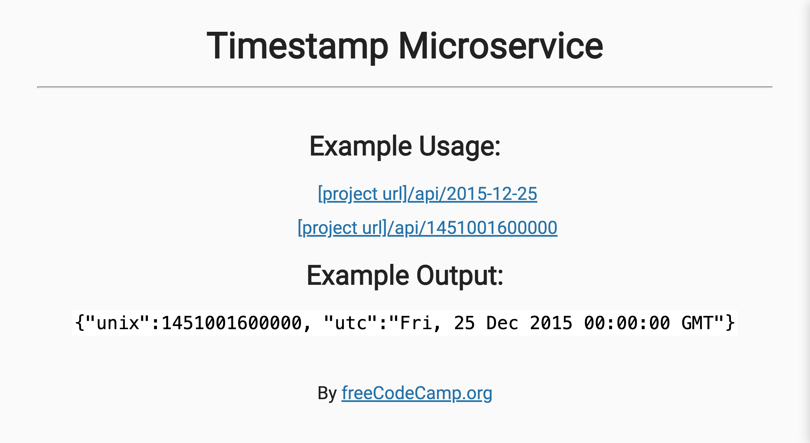

# Timestamp Microservice

This is a solution to the [freeCodeCamp backend project](https://www.freecodecamp.org/learn/back-end-development-and-apis/back-end-development-and-apis-projects/timestamp-microservice).

